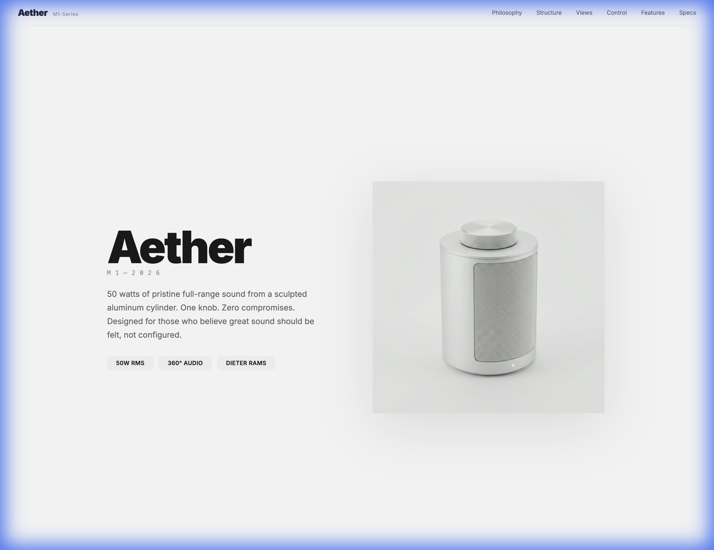
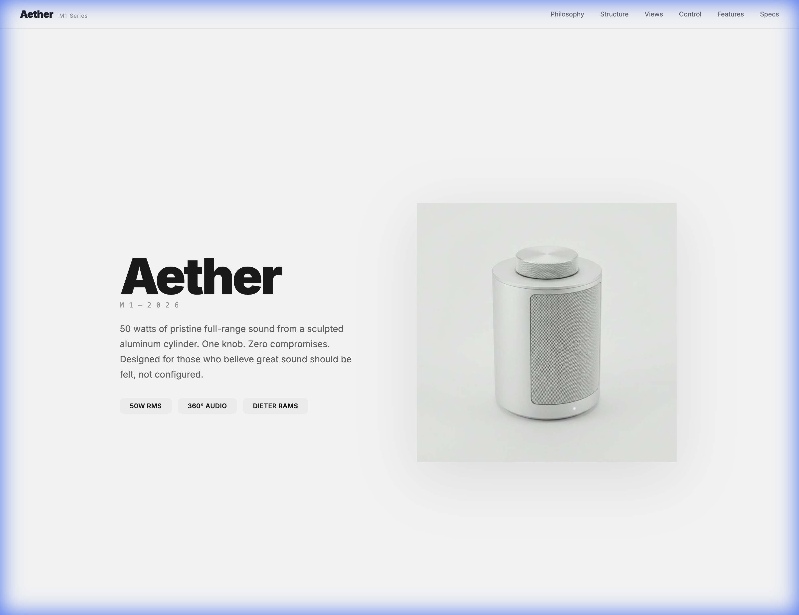
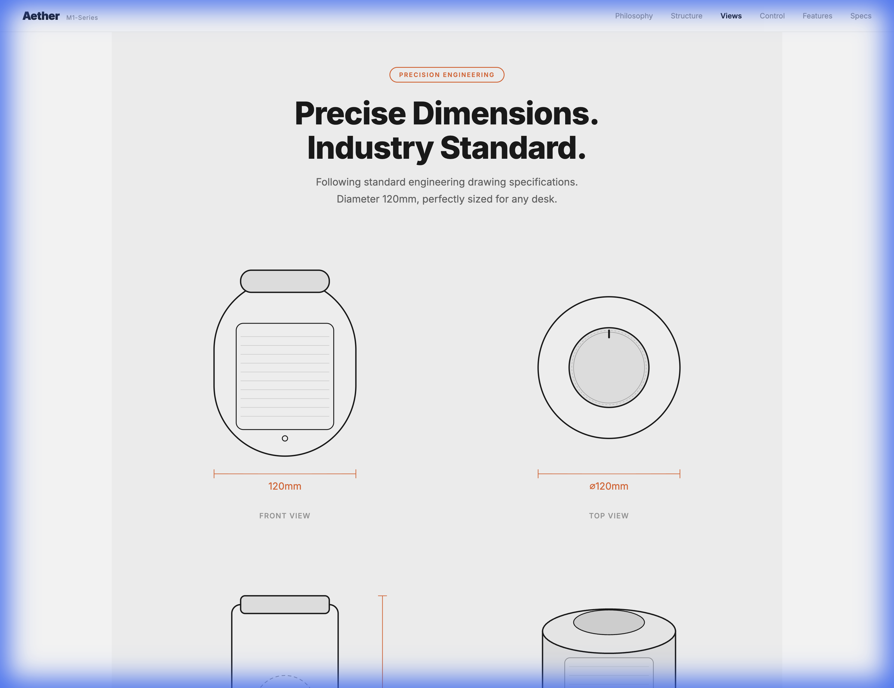
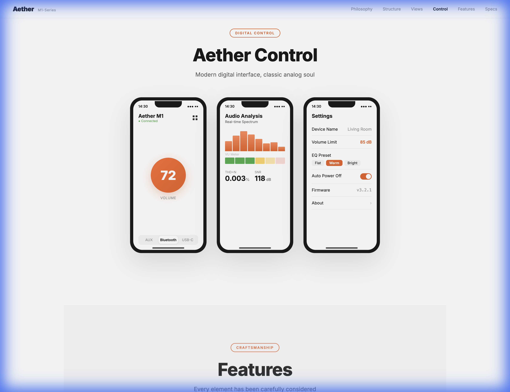
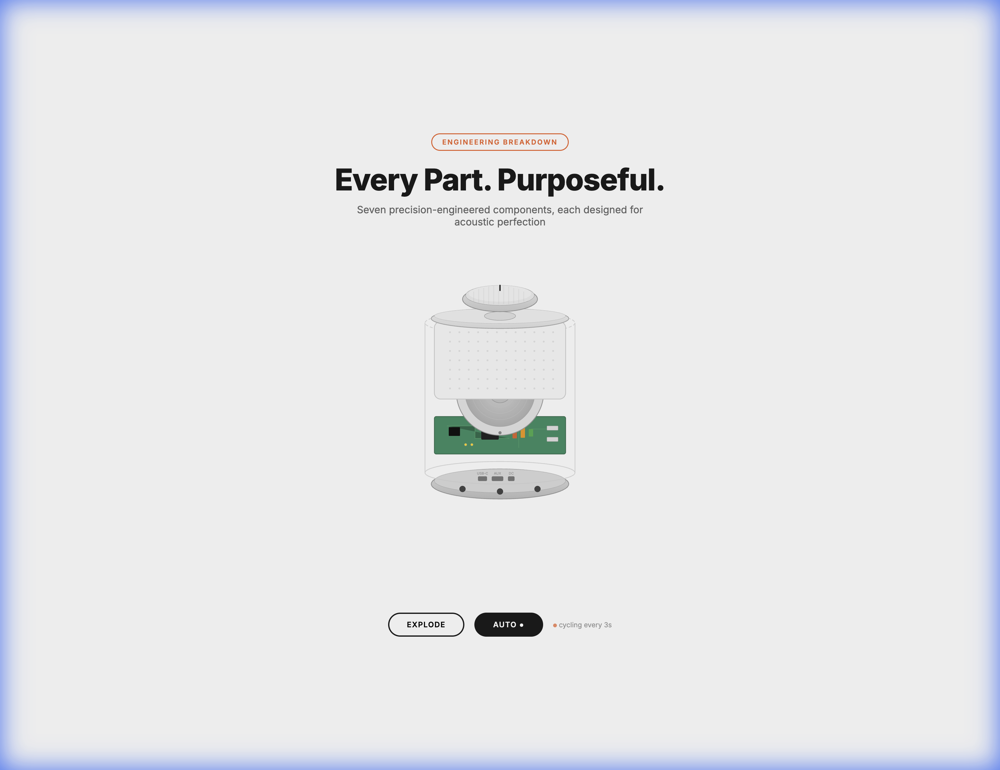
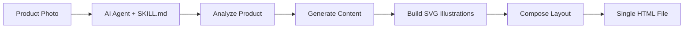

# 🎯 Product Landing Page Generator — AI Coding Agent Skill

**Turn a single product photo into a complete, premium product landing page. One image in → full website out.**

An AI coding agent skill that generates a complete, self-contained HTML product landing page from a single product image. The output features AI-generated SVG illustrations, orthographic engineering drawings, app mockups, animated exploded views, and a cohesive design system — all in one HTML file.

> Built for use with AI coding assistants like [Antigravity](https://codeium.com/antigravity), [Cursor](https://cursor.com), [Windsurf](https://codeium.com/windsurf), and other agentic coding tools that support skills/rules.

---

## ✨ What It Does

Feed the AI agent a product photo, and it will generate a **complete product landing page** with:

| Section | Description |
|---------|-------------|
| **Hero** | Full-bleed product showcase with auto-generated spec badges |
| **Design Philosophy** | Brand story with pullquote and accent typography |
| **Internal Structure** | SVG isometric cutaway or cross-section drawing |
| **Orthographic Views** | Engineering blueprint with front/side/top views and dimensions |
| **App Control** | Phone mockup with 3 app screens (for connected products) |
| **Exploded View** | Animated SVG teardown with component labels |
| **Features Grid** | Feature cards with inline SVG illustrations |
| **Specifications** | Full spec table with package drawing |

All sections are fully responsive and use inline SVG — no external dependencies or image files required (except the product photo itself).

---

## 📸 Demo: Aether M1 Speaker

Generated from a single speaker photo using the `rams` (Dieter Rams) style preset:

<p align="center">
  
</p>
<p align="center"><em>Hero section with animated spec badges and design philosophy</em></p>

<p align="center">
  
</p>
<p align="center"><em>SVG internal structure cutaway — entirely generated by the AI agent</em></p>

<p align="center">
  
</p>
<p align="center"><em>Engineering-style orthographic projections with dimensions</em></p>

<p align="center">
  
</p>
<p align="center"><em>Phone app control mockup with multiple screens</em></p>

<p align="center">
  
</p>
<p align="center"><em>Animated SVG exploded view with component labels and leader lines</em></p>

> 🔗 **Live demo**: Open `demo/aether-m1-official.html` in your browser to see the full page.

---

## 🚀 Quick Start

### 1. Install the Skill

Copy the skill directory into your AI coding assistant's skills folder:

```bash
# For Antigravity / Windsurf
cp -r product-landing-page-skill/ .agent/skills/product-landing-page/

# Or add a custom rules file pointing to SKILL.md
```

### 2. Run It

Provide a product image and a simple prompt:

```
Here's a photo of my product [attach image].
Generate a premium landing page using the product-landing-page skill.
```

Optional parameters:

```
Product name: Aether M1
Style preset: rams
Dark mode: false
```

### 3. Output

The agent outputs a **single self-contained HTML file** that you can:
- Open directly in any browser
- Deploy to any static hosting (Vercel, Netlify, GitHub Pages)
- Embed in an existing website

---

## 🎨 Style Presets

| Preset | Accent Color | Font | Inspired By |
|--------|-------------|------|-------------|
| `rams` | `#E85D2A` | Inter | Dieter Rams / Braun |
| `apple` | `#0071E3` | SF Pro / Inter | Apple |
| `muji` | `#B22222` | Noto Sans | MUJI |
| `bang-olufsen` | `#C5A258` | Playfair Display | Bang & Olufsen |
| `teenage-engineering` | `#FF6600` | Space Mono | Teenage Engineering |
| `custom` | User-specified | User-specified | Your vision |

---

## 📁 Project Structure

```
product-landing-page-skill/
├── SKILL.md                       # Main skill instructions (900+ lines)
├── README.md                      # This file
├── examples/
│   └── section_patterns.md        # Detailed section implementation patterns
├── templates/
│   └── prompt_structure.json      # Structured prompt template
└── demo/
    ├── aether-m1-official.html    # Full demo landing page
    ├── aether-m1-official-product.png  # Input product image
    ├── exploded-view-prototype.html   # Animated exploded view demo
    └── screenshot-*.png           # README screenshots
```

---

## 🧠 How It Works



1. **Analyze** — The AI agent examines the product photo to determine category, form factor, materials, key features
2. **Content** — Generates brand story, feature descriptions, technical specs
3. **Illustrate** — Creates inline SVG engineering drawings: cutaways, orthographic views, exploded views
4. **Compose** — Assembles everything into a responsive HTML page with CSS animations
5. **Output** — Single `.html` file, no dependencies, ready to deploy

---

## 📋 Requirements

- An AI coding assistant that supports custom skills/rules (Antigravity, Cursor, Windsurf, etc.)
- The AI agent needs image understanding capability (GPT-4o, Claude 3.5 Sonnet, Gemini Pro, etc.)
- No build tools, frameworks, or npm packages required

---

## 🙏 Acknowledgements

This skill was inspired by the incredible product landing page created by **SoulRich@ReadNote (小红书)**. Their original design showcased how a single product page can combine engineering aesthetics with premium web design, which directly inspired the development of this AI skill.

**Original inspiration**: [SoulRich@ReadNote](https://xhslink.com/m/8CASxPiIWaM)

---

## 📄 License

MIT License — feel free to use, modify, and share.

---

<p align="center">
  <em>Built with ❤️ and AI-assisted engineering</em>
</p>
